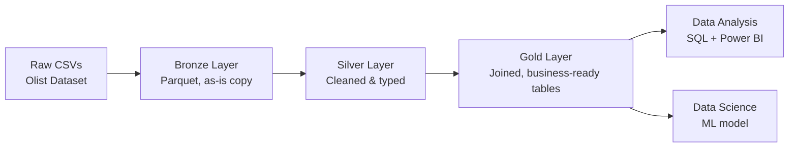

# Architecture v1 — Local Prototype

## Overview
End-to-end pipeline simulating a retail/e-commerce data platform, 
built locally first, to be mapped onto Azure services in a later phase.

## Diagram

## Notes
- Bronze: raw ingestion, no transformation, preserves source data as-is.
- Silver: cleaning, type casting, deduplication, null handling.
- Gold: joins and aggregations, star-schema style, ready for consumption.
- This is v1 (local-only). v2 will remap each stage to a specific Azure 
  service once the pipeline logic is proven locally.