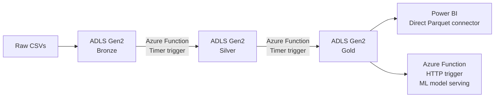

# Architecture v2 — Azure Deployment

## Diagram

## Notes
See `adr-001-azure-mapping.md` for full rationale behind each service choice.
This v2 diagram maps directly onto the local v1 medallion pipeline - same 
logical flow, cloud-hosted compute and storage.