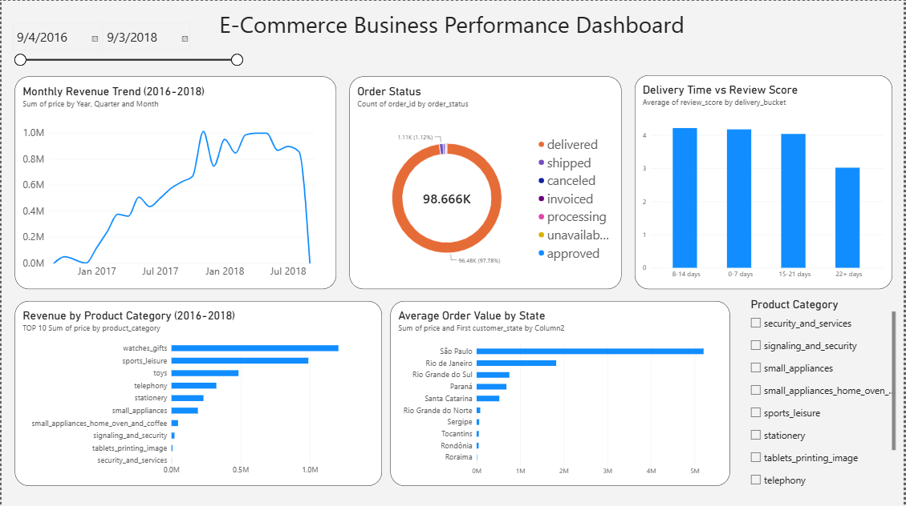

# Data Analysis — Phase 2

## Overview
SQL-driven business analysis and an interactive Power BI dashboard built on
the Phase 1 gold layer, answering core business questions for the simulated
e-commerce platform.

## Business questions answered
1. What are our monthly revenue trends?
2. Which product categories generate the most revenue?
3. Which states have the highest average order value?
4. Does delivery time affect customer review scores?
5. What's our order status breakdown?

## SQL analysis
Located in `sql/`, run via `scripts/run_query.py` (uses DuckDB to query the
gold Parquet files directly - no database server required).

## Dashboard
`dashboard.pbix` - interactive Power BI dashboard with date and category
slicers. See `dashboard_screenshot.png` for a static preview.

## Key findings
- Steady revenue growth from late 2016 through 2018, with a sharp spike in
  Nov 2017 (likely Black Friday).
- Health/beauty and watches/gifts are the top revenue categories.
- Delivery time has a clear negative relationship with review scores:
  orders delivered in 0-7 days average 4.41 stars vs. 3.06 for 22+ days.
- 97% of orders are successfully delivered.

## Data modeling note
Review scores required aggregating the raw reviews table to one row per
order (some orders had multiple review rows) before they could be reliably
related to the fact table - a good example of why cardinality/uniqueness
matters when building a star schema.